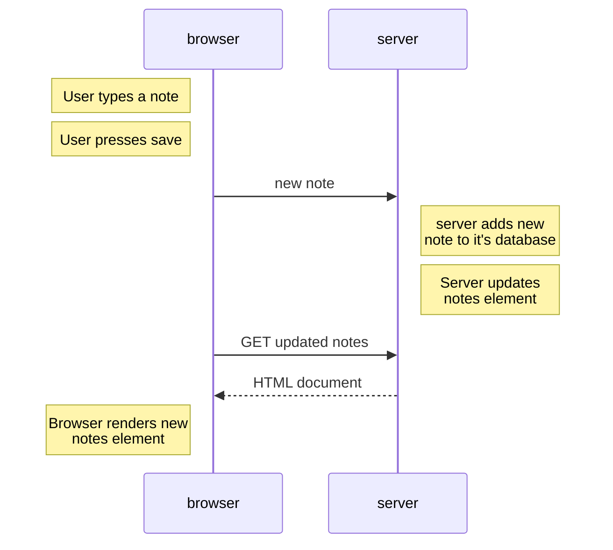

```mermaid
sequenceDiagram
    participant browser
    participant server

    Note left of browser: User types a note    
    Note left of browser: User presses save
    browser->>server: new note
    Note right of server: server adds new <br> note to it's database
    Note right of server: Server updates <br> notes element
    browser->>server: GET updated notes
    server-->>browser: HTML document
    Note left of browser: Browser renders new <br> notes element
```

